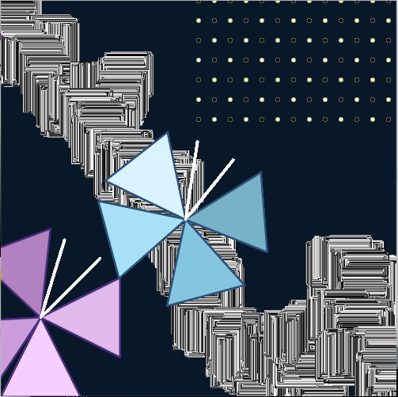

**Inspiration**

While creating this piece, I was inspired by [Casey Reas](https://reas.com/10_print/)' and [Bill Kolomyjec](http://recodeproject.com/artwork/v2n3random-squares)'s works. Reas designed prints using the symbols of an Commodore 64 in repition to create a pattern. In his lecture about [chance operations] (https://vimeo.com/45851523), Reas mentioned allow the computer to come up with certain values to create the artwork. Kolomyjec's *Random Squares* inspired movement within a standstill image. The certain numbers of squares within another and the position in which the final square lands leads viewers to see a 3-dimensional object on a 2-dimensional surface. In my image, I used a combination of Reas' and Kolomyjec's techniques. There are close together squares to form movement throughout my piece similar to *Random Squares*. I also used the random() function to determine the location of the squares, which is similar to Reas' method. 

Throughout the code, I was also inspired by [Austin Chang's] (https://github.com/l0rdf2l/CreativeProgrammingAndElectronics/blob/master/July%208/assignment1.pde) way of organizing the code, separating difficult purposes of the code by functions, and [Erik's color palette] (https://github.com/ehansmakes/CreativeProgrammingAndElectronics/blob/master/July_8/SelfPortraitV3.jpg) of his self-portrait. 

**Rules**

* Combine two objects in an unorthodox way

I chose to represent butterflies and fast movement. The butterflies are in the foreground and the quick drawn line is behind them. Butterflies, ususally peaceful creatures, would never be near chaotic movement but the improbability of that fact is captured within my piece.

* Include repition 

The butterflies' wings are the same shape but just rotated around an axis, the line in the background is composed of squares that move near each other, and the stars in the corner have the same width, height, and distance away from each other. 

* There must be some animation

Every time the program is run, the chaotic line in the background resets to do the included random() function and the stars twinkle, changing from black to yellow.

**Challenges**

I wanted to add more animation to my piece but do to the draw function only certain parts of my creation were appearing. Because the draw function repeats itself, it was difficult to figure out the types of loops I wanted to use. At first when trying out the transformation and rotation functions, I kept getting confused because I needed to reorient myself.

**Interesting Notes**

The main difference between a for and while loop when drawing is that the for loop is able to give precise lines or grid patterns. The while loop is better for abstraction and abstract locations. 
