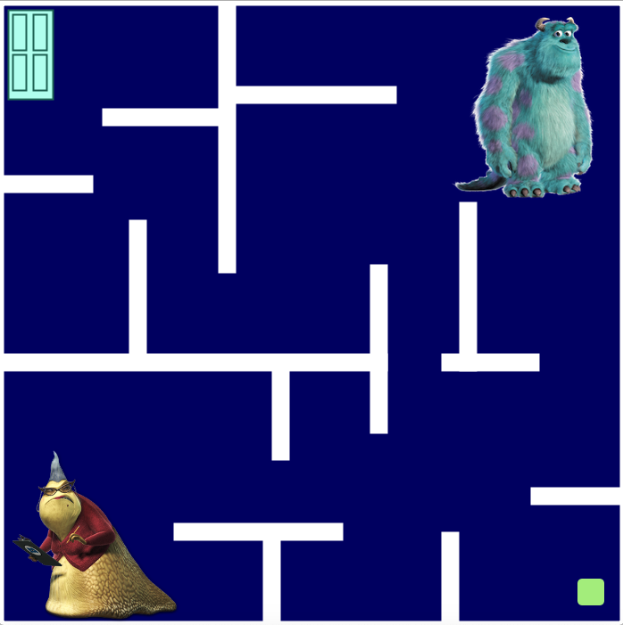

At first, I wanted to create a game with a bouncing character trying to reach the top of the screen using floating islands. However, I discovered that I could not alter the bouncing code to stop dropping at the bottom every time and in relation to the locations of the floating islands. For this idea, I was inspired by [Fire Boy and Water Girl](https://www.coolmathgames.com/0-fireboy-and-water-girl-in-the-forest-temple).

I then changed my idea into a timed maze puzzle. I had recently watched *[Inception,]*(https://www.youtube.com/watch?v=YoHD9XEInc0) a movie where dream thieves have to use complex mazes to perfect their craft. Despite this, my maze game is very simple. I was also inspired by *[Monsters, Inc.]*(https://youtu.be/8IBNZ6O2kMk). When I coded the door in the top corner for the original idea, I began thinking about *Monsters, Inc.* and the loveable characters than came along with the film. My game is based off of the movie.

**Rules**

* Play with the pixels

  I copied and altered the code from Professor Shiloh's lecture notes about constantly changing the background. I also used this alteration as a timer within the game.

* Import images
  
   I wanted to liven up the canvas screen with images of the characters from the movies. At first, I tried to move the pictures as the player but I figured out I couldn't due to the placement of the image in set-up and loading the image within a separate function.
   
* Include "game over" and "you won" title screens
  
   I coded title screen following the guidlines provided by Professor Shiloh within a separate function to determine if the player was within range of the doorway.
   
**Difficulties**

The main difficulty was not being able to use loops within the program due to the repetative draw function. I needed the draw function to repeat so that the path of the character was not seen but I had to determine the location for each struction. I also discovered that one must be fluid in the design and be prepared to change everything when the original idea does not work. I eventually worked around my first idea but finding another one was hard. I also did not understand how to ensure that the player could not pass the borders of the rectangles.
   
 **Interesting Take Aways**
 
 Processing has limitations but working with those limitations builds creativity and thinking critically. 
